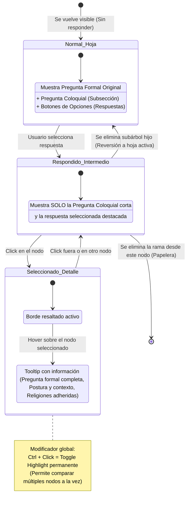

# Especificación Técnica: Visor Interactivo del Árbol de Posturas y Creencias

**Documento de Requerimientos y Diseño de Sistema**  
**Archivo fuente base:** [`recursos/posturas-creencias.md`](file:///c:/Repos/unidad-doctrinal-vault/recursos/posturas-creencias.md)  
**Ubicación de la aplicación:** `recursos/diagramas/arbol-web/`  
**Ubicación de los datos generados:** `recursos/diagramas/arbol-web/datos/posturas-creencias.json`

---

## 1. Resumen Ejecutivo y Propósito

El objetivo de este proyecto es construir una aplicación web interactiva, moderna, offline-first y sin dependencias de compilación (*zero-build*), que permita navegar, explorar y estudiar la estructura de clasificación teológica y filosófica definida en `recursos/posturas-creencias.md`.

A diferencia de los diagramas estáticos tradicionales (SVG/PNG), este visor ofrece:
1. **Divulgación Progresiva:** El árbol inicia colapsado en su nodo raíz y se expande dinámicamente conforme el usuario responde preguntas o abre ramas.
2. **Exploración Libre:** Permite explorar múltiples ramas paralelas sin forzar un cuestionario rígido de camino único.
3. **Fusión Compacta de Nodos:** Integra la postura y la pregunta en un único recuadro visual, reservando la separación física y un color distintivo únicamente para posturas con múltiples ejes de preguntas.
4. **Búsqueda Inversa por Tradición/Religión:** Permite seleccionar una creencia (ej. *Islam Suní/Chiita*, *Arrianismo de los JW*, *Judaísmo rabínico*) e iluminar automáticamente toda la ruta causal desde la raíz hasta las posturas que sostiene.
5. **Manipulación Espacial Híbrida:** Layout automático inteligente complementado con la capacidad de arrastrar y fijar (*pin*) nodos manualmente sin romper el grafo.
6. **Persistencia y Portabilidad:** Estado local automático y URLs compartibles con la vista exacta.

---

## 2. Arquitectura del Sistema y Entorno Técnico

### 2.1 Principios de Entrega Técnica
* **Zero-Build & Double-Click:** La aplicación se ejecuta abriendo directamente `index.html` en el navegador (compatible con `file://` o servidores locales ligeros), sin herramientas de empaquetado (*Webpack, Vite, Rollup*) ni `npm install`.
* **Vendorización de Dependencias:** Todo código externo necesario (por ejemplo, utilidades de SVG pan-zoom o algoritmos de layout si se requieren) se incluye directamente en el repositorio dentro de `arbol-web/vendor/`.
* **Renderizado Vectorial Puro:** Se utiliza SVG nativo con `viewBox` manipulado por transformaciones de matriz (`matrix` o `translate` + `scale`), garantizando zoom infinito sin pérdida de resolución ni pixelado.

### 2.2 Estructura de Directorios

```text
unidad-doctrinal-vault/
├── recursos/
│   ├── posturas-creencias.md
│   └── diagramas/
│       ├── Generar-Diagramas.cmd
│       ├── posturas-creencias.svg
│       ├── posturas-creencias.gv
│       ├── posturas-creencias.mmd
│       ├── posturas-creencias.dag
│       └── arbol-web/
│           ├── index.html
│           ├── css/
│           │   ├── variables.css
│           │   ├── canvas.css
│           │   ├── nodes.css
│           │   └── panel.css
│           ├── js/
│           │   ├── app.js
│           │   ├── state.js
│           │   ├── layout.js
│           │   ├── renderer.js
│           │   ├── router.js
│           │   └── search.js
│           └── datos/
│               └── posturas-creencias.json
└── scripts/
    ├── convertir_posturas_creencias.py
    └── convertir-posturas-creencias.ps1
```

### 2.3 Generación del Modelo de Datos (Pipeline Python)

El script [`scripts/convertir_posturas_creencias.py`](file:///c:/Repos/unidad-doctrinal-vault/scripts/convertir_posturas_creencias.py) se extiende con el argumento `--json` para generar automáticamente `posturas-creencias.json`.

#### Esquema del JSON (`posturas-creencias.json`):

```json
{
  "version": "1.0.0",
  "generated_at": "2026-08-21T00:00:00Z",
  "root_questions": ["Q1"],
  "questions": {
    "Q1": {
      "id": "Q1",
      "formal_text": "¿El universo fue causado por un Creador?",
      "colloquial_hint": "¿El universo fue creado?",
      "full_text": "¿El universo fue causado por un Creador?",
      "source_line": 57,
      "answers": [
        {
          "label": "Sí",
          "target_posture_id": "P1",
          "gloss": null
        },
        {
          "label": "No",
          "target_posture_id": "P2",
          "gloss": null
        }
      ]
    }
  },
  "postures": {
    "P1": {
      "id": "P1",
      "label": "Creacionismo",
      "is_unnamed": false,
      "is_suggested": false,
      "traditions": [],
      "wikilinks": [],
      "question_axes": ["Q2"]
    },
    "P8": {
      "id": "P8",
      "label": "Socinianismo*",
      "is_unnamed": false,
      "is_suggested": true,
      "traditions": [
        {
          "name": "Judaísmo moderno/liberal (académico)",
          "is_tentative": false,
          "is_note": false
        }
      ],
      "wikilinks": [],
      "question_axes": []
    }
  },
  "traditions_index": {
    "Judaísmo moderno/liberal (académico)": {
      "canonical_name": "Judaísmo moderno/liberal (académico)",
      "aliases": ["Judaísmo moderno", "Judaísmo liberal"],
      "posture_ids": ["P8"],
      "tentative": false
    },
    "Islam Suní/Chiita": {
      "canonical_name": "Islam Suní/Chiita",
      "aliases": ["Islam Suní", "Islam Chiita"],
      "posture_ids": ["P18"],
      "tentative": false
    }
  }
}
```

---

## 3. Modelo de Grafo, Topología y Semántica

### 3.1 Grafo Acíclico Dirigido (DAG) y Puntos de Convergencia (`&`)
* El árbol contiene nodos con **convergencia de múltiples padres** (ej. `Teísmo & Deísmo -> ¿Jesucristo realmente existió?` y `Encarnacionismo / Preexistencialismo & Subordinacionismo -> ¿El uso normativo y litúrgico...?`).
* **Representación:** Se modela como un **nodo único compartido** con múltiples aristas entrantes. No se duplican los nodos para preservar la integridad de las rutas de creencias y la verdad topológica.
* Las aristas convergentes muestran un indicador visual sutil (puerto de entrada unificado o glifo de unión `&`).

### 3.2 Semántica de Tradiciones y Sistemas de Creencias `{...}`
1. **Sinónimos con `/`:** En este recurso, la barra oblicua `{Islam Suní/Chiita}` denota sinonimia o inclusión dentro del alcance semántico del nodo, tratándose como una sola entrada canónica con alias de búsqueda.
2. **Adhesión Tentativa (`?`):** Entradas como `{SUD?}` o `{Catolicismo?}` se etiquetan con `is_tentative: true`. En el diagrama se resaltan con trazo discontinuo/punteado.
3. **Notas Excluidas:** Textos explicativos como `{No se identifica quién que sostenga esta postura}` se clasifican como notas descriptivas (van a `notes`, no a `traditions`) y se excluyen del listado general de religiones. El criterio automático es la longitud: cinco palabras o más se leen como nota, y el conversor lo advierte por consola cada vez. Cuando ese criterio se equivoca —un nombre largo de iglesia, un comentario corto— los prefijos `{tradición: …}` y `{nota: …}` lo fuerzan.
4. **Herencia Causal Ascendente:** Cuando se consulta una religión ligada a una postura hoja, el sistema infiere automáticamente que dicha tradición sostiene todas las posturas y respuestas afirmativas a lo largo de su camino hacia la raíz.
5. **Varias Tradiciones por Postura:** Una postura admite tantos `{...}` como haga falta y cada uno es una adhesión independiente: `? {Ortodoxia calcedonense} {Catolicismo?}`. Todas entran en `traditions` y en el índice canónico, que es de muchos a muchos (una tradición reúne varias posturas y una postura pertenece a varias tradiciones). Una tradición se marca `tentative` solo si **todas** sus adhesiones lo son. En el árbol, los distintivos de una tarjeta se muestran como puntos dorados y, si no caben todos, el último hueco lleva un «+N»; el tooltip y la ficha del panel siempre listan los nombres completos.

### 3.3 Posturas Innominadas (`?`) y Enlaces Obsidian (`[[...]]`)
* **Posturas `?`:** Se muestran visualmente con el texto *(sin nombre)* en color gris/itálica tenue. No son clickeables para abrir popups de religiones, pero conservan sus preguntas hijas.
* **Wikilinks:** Si una postura contiene `[[diotelitismo|Diotelitismo]]`, la etiqueta visible es *Diotelitismo* y el enlace relativo queda disponible en el panel de detalle.

---

## 4. Diseño Visual y Componentes de Nodos

### 4.1 Tipos de Nodos y Filosofía de Color

Para mantener el diseño limpio, moderno y legible sin sobrecargar la pantalla con decenas de colores innecesarios, se utilizan **exclusivamente 2 estilos estructurales de caja**:

*(Esto es solo un diagrama explicativo no índica una representación de cómo deberían ir las estructuras finales, se utiliza solamente para expresar la diferencia en el contenido de las cajas no su diseño ni estructura física final)*

```text
+-------------------------------------------------------------+
| TIPO 1: TARJETA UNIFICADA ESTÁNDAR                          |
| [ POSTURA: Creacionismo ]                                   |
| ¿El Creador se identifica como Dios?                        |
|                                                             |
|   [ (A) Sí ] --------------> (Abre rama Teísmo)             |
|   [ (B) No ] --------------> (Abre rama Deísmo)             |
+-------------------------------------------------------------+

                               |
                               v (En caso de múltiples ejes)

+----------------------------------+
| TIPO 2: POSTURA DIVIDIDA (BASE)  |
| [ Encarnacionismo ]              |
+----------------------------------+
          |                |
     (Eje A: Color       (Eje B: Color
      Diferencial)        Diferencial)
          |                |
          v                v
+------------------+  +--------------------+
| PREGUNTA EJE 1   |  | PREGUNTA EJE 2     |
| ¿Es igual a Dios?|  | ¿El AT es revelado?|
+------------------+  +--------------------+
```

1. **Tarjeta Unificada Estándar (95% de los casos):**
   * Un único recuadro redondeado con bordes suaves.
   * **Encabezado / Fondo Superior:** Muestra el nombre de la Postura.
   * **Peso del nodo:** Alineado a la derecha del encabezado (o de la fila de tipo, en la postura dividida) aparece `↓ N`: los nodos distintos que cuelgan de ese nodo en el árbol completo, no solo en lo desplegado. Un nodo al que se llega por dos ramas se cuenta una sola vez, y las hojas no muestran nada. La ficha de detalle repite el dato en «Nodos debajo», junto a «Ramas hijas», que sigue contando solo los hijos directos.
   * **Peso de cada respuesta:** Cada botón de respuesta lleva a su derecha su propio `↓ N`: el nodo al que lleva más todo lo que cuelga de él, es decir, cuánto árbol se abre al elegirla. La respuesta más poblada de la pregunta se distingue con un tono de caja apenas más claro, y solo si gana sin empate; ese realce cede el paso al azul de la respuesta ya elegida y al del hover. Como dos ramas hermanas pueden converger más abajo, la suma de los pesos de las respuestas puede superar el `↓ N` del nodo, que no cuenta dos veces lo compartido. El tooltip del botón y la lista de opciones de la ficha muestran el mismo dato.
   * **Cuerpo:** Muestra la pregunta que desafía o continúa dicha postura y sus opciones de respuesta interactivas.
   * **Color:** Paleta neutra oscura (gris grafito / azul oscuro profundo con borde sutil).
2. **Caso Especial de Postura Dividida (Multi-Eje):**
   * Ocurre únicamente cuando una postura origina **2 o más preguntas independientes** (como *Encarnacionismo / Preexistencialismo* o *Ateísmo cosmológico**).
   * La postura ocupa su propio nodo base.
   * Las preguntas secundarias que cuelgan de ella se muestran en recuadros separados con un **color de acento diferencial** (ej. ámbar/mostaza atenuado) para indicar claramente que son preguntas desgajadas de una misma postura.

---

## 5. Máquina de Estados del Nodo y Visualización de Preguntas

Cada nodo visible transita por 3 estados principales, variando la cantidad de texto que expone para optimizar el espacio en pantalla:



### 5.1 Especificación Detallada de Estados

| Estado | Evento Disparador | Contenido Visible en el Nodo | Contenido en Hover |
| :--- | :--- | :--- | :--- |
| **1. Normal (Hoja Activa)** | El nodo se vuelve visible como extremo del árbol no respondido. | **Pregunta formal completa** + **Pregunta coloquial** en subsección inferior + botones de respuesta (*Sí / No*). | Resaltado sutil del borde y opciones. |
| **2. Respondido (Intermedio)** | El usuario hace clic en una respuesta. | Se compacta: muestra **solo la pregunta coloquial corta** y la opción elegida. | Icono de papelera en esquina superior derecha para deshacer. |
| **3. Seleccionado** | Clic simple sobre un nodo respondido. | Borde iluminado con anillo de foco (*focus ring*). Abre panel lateral de detalle. | Al hacer hover sobre el nodo seleccionado, se despliega el **tooltip enriquecido** con la pregunta original formal completa y metadatos. |
| **+ Highlight'eado** | `Ctrl + Clic` en cualquier nodo visible. | Resaltado cromático persistente (*glow* cian/violeta). Permite multi-selección simultánea. | Mantiene el highlight sin deseleccionar los otros nodos marcados. |

---

## 6. Mecánicas de Navegación, Layout y Manipulación Espacial

### 6.1 Zoom, Pan y Control de Cámara
* **Rueda del ratón:** Zoom in / Zoom out directo y fluido, centrado en la coordenada del cursor del mouse.
* **Arrastrar lienzo (Pan):** Clic sostenido y arrastre sobre el fondo para desplazar la cámara.
* **Doble clic en nodo:** Centra la cámara y ajusta el nivel de zoom para encuadrar el nodo y sus descendientes inmediatos.
* **Minimapa flotante:** Esquina inferior izquierda con visor general del grafo y recuadro de vista actual (*viewport*).

### 6.2 Layout Automático Dinámico vs. Reacomodo Manual (*Pinning*)
Para evitar conflictos entre el cálculo automático de posiciones y el movimiento libre del usuario:

1. **Auto-Layout Jerárquico por Niveles (Dagre / Sugiyama):**  
   Al abrir o colapsar ramas, el layout calcula posiciones óptimas con transiciones animadas CSS/SVG (*ease-in-out*, 300ms) para que el árbol respire orgánicamente.
2. **Fijación Manual (*Pinning*):**  
   * Si el usuario arrastra físicamente un nodo, este adquiere la propiedad `pinned: true` y un micro-icono de chincheta discreto.
   * Las aristas conectadas (curvas Bezier cúbicas) se recalculan en tiempo real a 60 FPS durante el arrastre.
   * Si se abren nuevos hijos de un nodo fijado, el motor de layout calcula la posición relativa de los nuevos elementos tomando como ancla la posición manual del padre.
3. **Botón Flotante "Reorganizar Árbol":**  
   Restaura todos los nodos fijados a sus posiciones óptimas automáticas de forma animada.

### 6.3 Poda y Eliminación de Ramas (Papelera)
* Al pasar el cursor (*hover*) sobre un nodo respondido, se muestra un icono de **papelera** en la esquina superior derecha.
* **Acción:** Al hacer clic en la papelera, se **deshace la respuesta** de ese nodo y se eliminan del lienzo todos los subárboles descendientes que dependían exclusivamente de ella.
* **Reversión:** El nodo actual vuelve inmediatamente a su **Estado 1 (Normal / Hoja Activa)**, mostrando nuevamente su pregunta formal completa y sus botones de selección.

---

## 7. Módulo de Exploración por Religión / Tradición (Búsqueda Inversa)

### 7.1 Selector Global y Buscador
Un menú lateral desplegable permite buscar y seleccionar cualquier tradición registrada en el índice canónico (ej. *Testigos de Jehová*, *Judaísmo rabínico/talmúdico*, *Islam Suní/Chiita*, *Ortodoxia calcedonense*).

### 7.2 Comportamiento al Seleccionar una Religión
1. La aplicación activa el **Modo Explorador de Creencias** (sub‑modo de *Razonamiento y Comparación* cuando está activo).
2. Despliega automáticamente todos los nodos del árbol necesarios para conectar la raíz con las posturas sostenidas por la tradición seleccionada **y con cualquier postura suelta que se haya elegido aparte**.
3. Ilumina el camino completo (*breadcrumb visual / trazo dorado*) desde la raíz hasta las posturas finales.
4. Si una adhesión es tentativa (`is_tentative: true`), las aristas hacia esa postura se dibujan con línea punteada dorada.
5. El panel lateral muestra la ficha completa de la tradición, sus posturas asociadas, **así como una sección de “Posturas”** con todas las del árbol, y las notas históricas.

---

## 8. Persistencia y Estado Compartible

### 8.1 Almacenamiento Local (`localStorage`)
La aplicación guarda automáticamente:
* Respuestas seleccionadas en cada nodo.
* Nodos resaltados (*highlights* de Ctrl+Clic).
* Posiciones de nodos anclados (*pinned coordinates*).
* Nivel de zoom, posición de cámara y tema (oscuro/claro).

### 8.2 URLs Compartibles (`URL SearchParams`)
Permite compartir enlaces con el estado exacto del diagrama codificado en base64 o query string compacto:
* `?path=Q1:A,Q2:B,Q5:A&hl=P1,P8&view=auto`
* Al abrir la URL, el visor reconstruye las respuestas, expande los nodos exactos, aplica los resaltados y enfoca la cámara.

---

    Pulido estético y Tema Oscuro/Claro       :2026-09-10, 2d
```

---

## 9. Modo de Razonamiento y Comparación

### 9.1 Descripción General
Este modo, que podría denominarse **Modo de Razonamiento y Comparación** (o *Modo Razonalizador*), extiende el **Modo Explorador de Creencias**. Permite al usuario seleccionar una tradición, sistema de creencias o un conjunto de ellas y, en lugar de desplegar únicamente el árbol gráfico, se muestra la misma estructura **en formato lista** con las respuestas asignadas a cada nodo.

### 9.2 Funcionalidad de Lista de Respuestas
- Al seleccionar una tradición, el sistema genera una lista anidada que recorre cada pregunta del árbol y muestra la **respuesta elegida** (sí/no u otras opciones) para esa tradición.
- Cada entrada incluye:
  1. Texto de la pregunta (formal y coloquial).
  2. La respuesta seleccionada.
  3. Identificador de la postura asociada.
- La lista se actualiza dinámicamente al cambiar respuestas o al pinchar en diferentes tradiciones.

### 9.3 Comparación Multi‑Tradición
- El usuario puede seleccionar **varias tradiciones simultáneamente**.
- El modo combina sus listas en una vista comparativa donde cada pregunta aparece una única vez y, a la derecha, se listan las respuestas de cada tradición seleccionada.
- Las diferencias entre respuestas se resaltan con colores (por ejemplo, verde para consenso, rojo para divergencia) y se ofrece una herramienta de filtrado para mostrar solo los nodos con desacuerdo.

### 9.4 Inclusión de Posturas
- Además de religiones, el modo incluye **posturas** (cualquier postura nombrada del árbol, con tradición o sin ella) siempre que tengan respuestas asignadas.
- Las posturas se listan bajo una sección separada "Posturas" para que el usuario pueda comparar sus respuestas con las de tradiciones específicas. Elegir una postura afiliada la compara sola, sin arrastrar las demás posturas de su tradición; en el modo no compacto la ficha de la lista indica a qué tradiciones la liga el documento.

### 9.5 Integración con el Explorador de Creencias
- Este modo se presenta como **sub‑modo** dentro del selector global del Explorador de Creencias.
- En la UI, al hacer clic en el botón "Razonar y Comparar" dentro del panel del Explorador, se activa la vista de lista y se mantiene la capacidad de volver al árbol gráfico con un toggle.

### 9.6 Consideraciones de UX
- La vista lista soporta **colapsado/expandido** por nivel de profundidad para evitar sobrecargar al usuario.
- Se proveen **acciones de exportación** (CSV, JSON) y **copiar al portapapeles** para que el análisis externo sea sencillo.
- Se conserva la **persistencia** del modo activo y de las selecciones en `localStorage` y en URLs compartibles, igual que el resto del visor.

---

## 10. Criterios de Aceptación y Validación

1. **Autonomía Offline:** El archivo `index.html` en `recursos/diagramas/arbol-web/` se abre con doble clic en cualquier navegador moderno sin conexión a internet ni servidores externos.
2. **Precisión de Conversión:** `posturas-creencias.json` coincide exactamente con los 209 renglones de `recursos/posturas-creencias.md` sin perder posturas, alternativas ni tradiciones.
3. **Escalabilidad Vectorial:** El zoom in/out se mantiene perfectamente nítido a cualquier nivel de magnificación.
4. **Fidelidad Topológica:** Las convergencias `Teísmo & Deísmo` y `Encarnacionismo & Subordinacionismo` se renderizan como nodos únicos con múltiples entradas.
5. **Ergonomía de Preguntas:** Los nodos hojas exponen la pregunta formal y coloquial; los nodos respondidos se compactan a la versión coloquial y exponen la original únicamente bajo interacción intencional (Selección + Hover).
